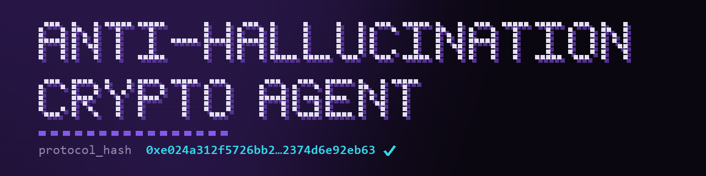

> A Python agent that analyzes crypto markets using AI, and **proves** it didn't make anything up.


[](https://github.com/Jegoba90/anti-hallucination-crypto-agent/actions/workflows/tests.yml)


---

## The Problem

Every AI crypto tool sounds confident. None of them can prove they didn't invent the data.

Ask an LLM to analyze Bitcoin and it will tell you the volume is "moderate", the movement is "significant", and the lower Bollinger Band is holding as support, even when the math says the price is sitting at dead center with a Z-Score of -0.6. That's not analysis. That's pattern-matching from training data dressed up as financial insight.

In traditional software, a wrong answer is a bug you can catch. In AI, a confident wrong answer looks **identical** to a confident right one. That's not a UX problem: it's a capital risk.

We built a different architecture. Before any insight reaches you, a deterministic Python math engine runs four sequential filters over the LLM's output, strips every claim that contradicts the actual numbers, and emits a **cryptographic receipt** proving exactly what was corrected.

---

## How It Works


Left to right, box by box:

- **Market Data.** Price and news for the asset. This is third-party input: in this system the raw feed is never the product, only the raw material.
- **Layer 1 · Math Engine.** Python computes the Z-Score, Bollinger Bands and market regime *before* the LLM sees anything. This is the ground truth every later step defends.
- **Layer 2 · Prompt Injection (10 Laws).** Those math values go into the prompt as non-negotiable constraints. Laws 0-9 bound what the model is even allowed to claim.
- **LLM.** Writes the language, and only the language. It never gets the last word on a number, and it cannot invent one.
- **Layer 3 · Numeric Override.** Once the model answers, Python reclaims every numeric field. On any collision between the prose and the math, the math wins.
- **Layer 4 · Lexical Filters.** Four deterministic filters (~300 lexical patterns) strip inflated volume claims, magnitude inflation, false-certainty markers and band-position contradictions.
- **Verified Insight + SHA-256 seal.** The grounded narrative ships with a `protocol_hash` certifying exactly which corrections ran. The same inputs always produce the same digest, so anyone can re-verify it independently.

The LLM generates the language. The math engine generates the truth.

---

## Same question, two kinds of answer

Anyone can rerun this. On 2026-07-20, in plain conversational mode with no live-data tools, we asked GPT-5.5, Gemini 3.1 Pro and the Radar agent the same question about Bitcoin: where is price relative to its Bollinger Bands, what is the short-term sentiment, and how confident are you? The raw replies and Radar's full JSON are saved in [`docs/comparisons/2026-07-20-btc/`](docs/comparisons/2026-07-20-btc).

We are not claiming the raw models are wrong. We cannot prove that, and neither can they. The claim is narrower, and it is the whole point of the product: **one of these three answers you can check, the other two you cannot.**

| | Raw LLM (GPT-5.5 / Gemini 3.1 Pro) | Radar Agent |
|---|---|---|
| **Where the read comes from** | the model's own prose | a stated computation: Z-Score `0.2254`, Bollinger bandwidth `0.0773`, over a live price series |
| **Are the inputs shown?** | no | yes, in the `math_diagnostics` block |
| **Can you reproduce the result?** | no, it changes on every run | yes, recompute the SHA-256 from the payload ([Verify the Hash Yourself](#verify-the-hash-yourself)) |
| **Sources behind the claim** | none | two cited headlines, Tier 1 and Tier 2, over a 24h window |
| **What the seal proves** | there is nothing to seal | that the pipeline ran with exactly these values and was not tampered with (`process_seal`). It does not claim to be the market truth; it makes the read checkable |

Asked where price sat in the bands, GPT-5.5 answered "around the middle", Gemini 3.1 Pro said it had no live data and pointed to TradingView, and the Radar agent returned `TERCIO_SUPERIOR` along with the Z-Score it was derived from and the hash `0x8f96020d…83fd059`. Whether "middle" or "upper third" is the truer label is not the argument. You can recompute the Radar answer from the numbers it shipped; you cannot recompute the other two.

---

## Quick Start

Requires **Python 3.11+**. No signup required: the demo key is pre-configured for BTC and ETH.

```bash
# 1. Clone
git clone https://github.com/Jegoba90/anti-hallucination-crypto-agent.git
cd anti-hallucination-crypto-agent

# 2. Install dependencies
pip install -r requirements.txt

# 3. Run
python agent.py coin bitcoin
```

That's it. No key to configure: the agent falls back to the public demo key on its
own. You'll see the analysis **and** the audit trail proving it was verified.

> **Want to analyze more coins?** The demo key is limited to BTC and ETH.
> Get your free 14-day trial (no credit card): [cryptocapi.com](https://cryptocapi.com).
> Then `cp .env.example .env` (Windows cmd: `copy .env.example .env`) and set
> `CRYPTOCAPI_API_KEY=sk_live_...` in it.

---

## Output

```
───────────────────────────────────────────────────────
  CRYPTOCAPI RADAR — Bitcoin (BTC)
  2026-06-19 14:32:07 UTC
───────────────────────────────────────────────────────

  ↔️  MARKET REGIME:   RANGING_CHOP
  ➡️  SENTIMENT:       neutral
  🎯 CONFIDENCE:      MEDIUM (0.64)
  🔺 Z-SCORE:         -0.637 (no anomaly)

  ANALYSIS:
   El activo opera en zona de equilibrio técnico sin catalizador
   fundamental relevante en las últimas 24h. Las bandas de Bollinger
   muestran compresión consistente con una fase lateral consolidada.

───────────────────────────────────────────────────────
  🛡️  ANTI-HALLUCINATION AUDIT TRAIL
───────────────────────────────────────────────────────

  Pipeline:  Radar 4-Layer Anti-Hallucination Pipeline
  Version:   v2.1.0-radar
  Seal type: process_seal
             Certifies the 4-layer pipeline ran with these
             exact corrections. Text is not reproducible
             (LLM is non-deterministic by design).

  Filters fired (2):
    ✂️  [LEY 7 volume]  Removed a qualitative volume claim:
                       the system has no volume data
    ✂️  [band position CENTRO_BANDAS]  Removed a band-edge
                       claim: the price was at CENTRO_BANDAS

  Corrections applied to the LLM's output (2):
    ✏️  sentiment
        Python overrode the LLM's verdict (Z-Score rule)
    ✏️  analysis.detailed_report
        the lexical filters rewrote the narrative

  Fields Python owns, never the LLM (5):
    🔒  analysis.anomaly_details
        the anomaly description. Written from the Z-Score or left
        empty. The AI cannot invent one
    🔒  analysis.confidence
        the HIGH / MEDIUM / LOW label, derived from the score, not
        from the AI's wording
    🔒  analysis.sentiment_score
        the numeric sentiment inside the report, computed from the
        Z-Score
    🔒  confidence
        how sure the call is. Derived from the math, never from how
        assertive the AI sounded
    🔒  is_volatility_alert
        the volatility flag. Raised by the Bollinger bandwidth alone

  The math engine writes these on every response, whatever the LLM said.

  Protocol hash (SHA-256):
    0xe024a312f5726bb2213c018e8fef8228dde21506655ca57295f2374d6e92eb63

───────────────────────────────────────────────────────
  ✅ Math Override Certified (CTC-2026)
───────────────────────────────────────────────────────
```

---

## Commands

**Works with the pre-configured demo key (BTC & ETH):**

```bash
# Analyze a single coin
python agent.py coin bitcoin
python agent.py coin ethereum

# Watch mode: refresh every 30 minutes, flag sentiment changes
python agent.py coin bitcoin --watch
python agent.py coin bitcoin --watch --interval 15

# Raw API response, audit trail included: verify the hash yourself
python agent.py coin bitcoin --json
```

**Requires a free trial key (any coin + the Quant Pro engines):**

```bash
# Any other coin
python agent.py coin solana

# Market scan: rank all tracked assets by signal strength
python agent.py scan
python agent.py scan --strategy aggressive --limit 5
python agent.py scan --strategy conservative

# Batch: analyze multiple coins in one request
python agent.py batch bitcoin ethereum solana
```

> Get your free 14-day trial (no credit card): [cryptocapi.com](https://cryptocapi.com)

---

## Use Cases

Every scenario below maps to a runnable script in `examples/`, so the fastest
way to explore one is to open the file and run it.

### Sanity-check a coin before acting on an AI signal

Somewhere, a confident AI is calling Bitcoin "clearly bullish" right now. Ask
this agent instead: you get the verdict plus the receipt. If the LLM's take
contradicted the Z-Score, the override shows up in the audit trail, so you see
whether the AI had to be corrected before the answer reached you.

```bash
python agent.py coin bitcoin
# minimal version in code: python examples/basic_analysis.py
```

### Watch a position and catch sentiment flips

Poll a coin every N minutes and get flagged the moment the sentiment changes.
Each refresh ships its own audit trail, so when a flip happens you can tell
whether the math forced it (`sentiment_override: true`) or the narrative moved
on its own.

```bash
python agent.py coin bitcoin --watch --interval 15
# script version: python examples/watch_mode.py bitcoin 15
```

### Screen the market before entering a trade

Rank every tracked asset by signal strength under a risk profile and shortlist
the top N. This path runs on the Quant engines, which are pure math: no LLM is
involved anywhere in a scan.

```bash
python agent.py scan --strategy aggressive --limit 5
# script version: python examples/market_scanner.py aggressive 5
```

### Compare assets side by side

One request, several coins, the same deterministic yardstick. Useful for the
"rotate ETH into SOL?" kind of question, where you want both candidates
measured identically instead of narrated separately.

```bash
python agent.py batch bitcoin ethereum solana
# script version: python examples/batch_compare.py bitcoin ethereum solana
```

### Archive analysis you can re-verify later

Because every response carries its `protocol_hash`, a JSON dump is not just a
log: it is evidence. Store the raw responses and you can prove, months later,
that the analysis you acted on was never altered after the fact.

```bash
python agent.py coin bitcoin --json > btc.json
```

The next section shows exactly how to recompute the hash from that file.

### Feed verified data to your own AI agent

The inverse use case: your own LLM app needs market context, and you would
rather not inherit someone else's hallucinations. Copy the `cryptocapi/`
package, call `get_insight()`, and hand your model numbers computed by Python
and text that already went through the 4-layer pipeline. See
[Use It in Your Own Code](#use-it-in-your-own-code).

> Single-coin analysis, watch mode and the JSON dump run on the pre-configured
> demo key (BTC & ETH). Market scan and batch need a
> [free 14-day trial key](https://cryptocapi.com).

---

## Verify the Hash Yourself

The Radar `protocol_hash` is a SHA-256 digest of exactly eight fields: the
pipeline identity (`algorithm_id`, `engine_version`), the math inputs that
drove the overrides (`z_score`, `market_regime`, `sentiment`,
`sentiment_override`), and the sorted lists of what the pipeline touched
(`filters_applied`, `fields_overridden`). No wall-clock timestamp is hashed,
so the same inputs always produce the same digest.

A word on `fields_overridden`, because the output above splits it in two and the
seal does not. Five entries are always present (`analysis.anomaly_details`,
`analysis.confidence`, `analysis.sentiment_score`, `confidence`,
`is_volatility_alert`): the math engine writes those on every single response, so
the LLM never gets a say. That is a **guarantee**, not a catch, and the CLI labels
it as such. Two more entries are conditional, and those are the real catches:
`sentiment` shows up only when the Z-Score rule overrode the LLM's verdict, and
`analysis.detailed_report` only when a lexical filter cut text out of it. The run
above has both, which is why it seals seven.

The seal hashes the raw union of the seven, exactly as the API ships it.

This is the exact payload behind the output above, and the same fixture the test
suite runs against. Run it and you get that exact hash, with no dependencies and
no CryptoCapi account needed:

```python
import hashlib, json

payload = {
    "algorithm_id": "Radar 4-Layer Anti-Hallucination Pipeline",
    "engine_version": "v2.1.0-radar",
    "z_score": -0.6367,
    "market_regime": "RANGING_CHOP",
    "sentiment": "neutral",
    "sentiment_override": True,
    "filters_applied": ["LEY 7 volume", "band position CENTRO_BANDAS"],
    "fields_overridden": [
        "analysis.anomaly_details",
        "analysis.confidence",
        "analysis.detailed_report",
        "analysis.sentiment_score",
        "confidence",
        "is_volatility_alert",
        "sentiment",
    ],
}

serialized = json.dumps(payload, sort_keys=True, separators=(",", ":"))
digest = "0x" + hashlib.sha256(serialized.encode()).hexdigest()

print(digest)
# → 0xe024a312f5726bb2213c018e8fef8228dde21506655ca57295f2374d6e92eb63
```

### Now do it on a live response

Dump exactly what the API returned, audit trail included:

```bash
python agent.py coin bitcoin --json > btc.json
```

Then rebuild the payload from that file and hash it. Note the one precision
detail: the seal hashes `z_score` rounded to **6 decimals**, while the response
exposes it at full float precision, so round it first.

```python
import hashlib, json

response = json.load(open("btc.json"))
math = response["math_diagnostics"]
trail = math["audit_trail"]

payload = {
    "algorithm_id": trail["algorithm_id"],
    "engine_version": trail["engine_version"],
    "z_score": round(math["z_score"], 6),
    "market_regime": math["market_regime"],
    "sentiment": response["sentiment"],
    "sentiment_override": trail["sentiment_override"],
    "filters_applied": trail["filters_applied"],
    "fields_overridden": trail["fields_overridden"],
}

serialized = json.dumps(payload, sort_keys=True, separators=(",", ":"))
digest = "0x" + hashlib.sha256(serialized.encode()).hexdigest()

print(digest == trail["protocol_hash"])
# → True
```

If it prints `True`, the pipeline ran with those exact corrections and nothing was
tampered with in transit.

---

## Use It in Your Own Code

The `cryptocapi/` package is designed to be copied directly into your project:

```python
import asyncio
from cryptocapi import CryptoCapiClient, parse_audit_trail

async def main():
    # "demo_btc_eth_public" works out of the box for BTC/ETH; use your
    # own sk_live_... key (14-day trial) to analyze any other coin.
    client = CryptoCapiClient(api_key="demo_btc_eth_public")
    data = await client.get_insight("bitcoin")

    # Use the insight (note the nesting, see cryptocapi/models.py)
    print(data["sentiment"])                          # neutral
    print(data["math_diagnostics"]["market_regime"])  # RANGING_CHOP
    print(data["asset"]["symbol"])                     # BTC

    # Inspect the audit trail
    math = data.get("math_diagnostics", {})
    audit = parse_audit_trail(math.get("audit_trail"))

    if audit.is_pro:
        print(f"Filters fired: {[f[0] for f in audit.filters]}")
        print(f"Fields Python overrode: {audit.fields_overridden}")
        print(f"Hash: {audit.protocol_hash}")

asyncio.run(main())
```

The client raises three errors, all importable straight from `cryptocapi`:

| Error | When it fires |
|---|---|
| `DemoCoinRestricted` | the demo key asked for a coin outside BTC and ETH |
| `ProEngineRequired` | `get_market_scan` or `get_batch_signals` ran on a key that doesn't reach the Quant engines |
| `UnexpectedResponse` | the API answered with something other than the envelope `models.py` describes |

The first two carry the API's own wording in `.user_message`, so you can show it to
a user as it is.

---

## Project Structure

```
├── agent.py               # CLI entry point (Typer)
├── cryptocapi/
│   ├── client.py          # Async HTTP client: copy this into your project
│   ├── models.py          # TypedDicts for full API response
│   └── audit.py           # Audit trail parser + filter explanations
├── display/
│   ├── terminal.py        # Rich terminal renderer
│   └── themes.py          # Color scheme
├── examples/
│   ├── basic_analysis.py  # Minimal: analyze BTC in 20 lines
│   ├── watch_mode.py      # Poll + detect sentiment changes
│   ├── market_scanner.py  # Screener using market-scan endpoint
│   └── batch_compare.py   # BTC vs ETH vs SOL side by side
└── tests/
    ├── test_audit_parser.py        # Parser + hash reproducibility
    ├── test_readme_consistency.py  # Pins this README to the fixture
    ├── test_render_audit.py        # The audit block's claims survive the renderer
    ├── test_render_verdict.py      # The CLI shows the engine's verdict, never its own
    ├── test_render_sources.py      # The evidence behind the narrative reaches the screen
    ├── test_pro_required.py        # The Quant plan gate reads as an offer, not an HTTP error
    ├── test_terminal_encoding.py   # The output survives a terminal that isn't UTF-8
    └── fixtures/sample_response.json
```

---

## Run the Tests

```bash
pip install pytest
pytest tests/ -v
```

No network calls and no API key required: every test runs against a local
fixture. That includes the check that reproduces the `protocol_hash` documented
above, so a change to the pipeline that broke the seal would fail the suite.

---

## Powered by CryptoCapi

This agent is built on [CryptoCapi](https://cryptocapi.com), a crypto intelligence API designed specifically for machine consumption.

That machine-first design is concrete: the API publishes a live [`llms.txt`](https://www.cryptocapi.com/llms.txt) that maps every endpoint, its parameters and response shapes in the format AI agents read. This repo shows the *copy-a-typed-client* path; `llms.txt` is the *zero-code* one, an agent in Claude Code, Cursor or Copilot discovers the whole API on its own. Works anywhere: Claude Code · Cursor · GitHub Copilot · ChatGPT · LangChain · any REST client.

Unlike general-purpose LLM wrappers, CryptoCapi's Radar engine runs a deterministic Python math pipeline between the AI and every API response. Every numeric field is computed by Python, not the LLM. Every qualitative claim is cross-validated against the math. And every response ships with a SHA-256 audit trail you can verify independently.

Want to look under the hood? [CryptoCapi-Portfolio](https://github.com/Jegoba90/CryptoCapi-Portfolio) documents the architecture behind the API: the three engines, the 4-layer pipeline, the seal semantics per engine ([SEAL.md](https://github.com/Jegoba90/CryptoCapi-Portfolio/blob/main/docs/SEAL.md)), and real sealed responses captured from production.

**Get your free 14-day trial** (no credit card required): [cryptocapi.com](https://cryptocapi.com)

---

## ⚠️ Disclaimer

This tool is for educational and informational purposes only. It does not constitute financial advice. Never make investment decisions based solely on automated analysis tools. Crypto markets are highly volatile and past performance does not indicate future results.

---

## License

MIT: use it, fork it, copy the `cryptocapi/` package into your own project.
