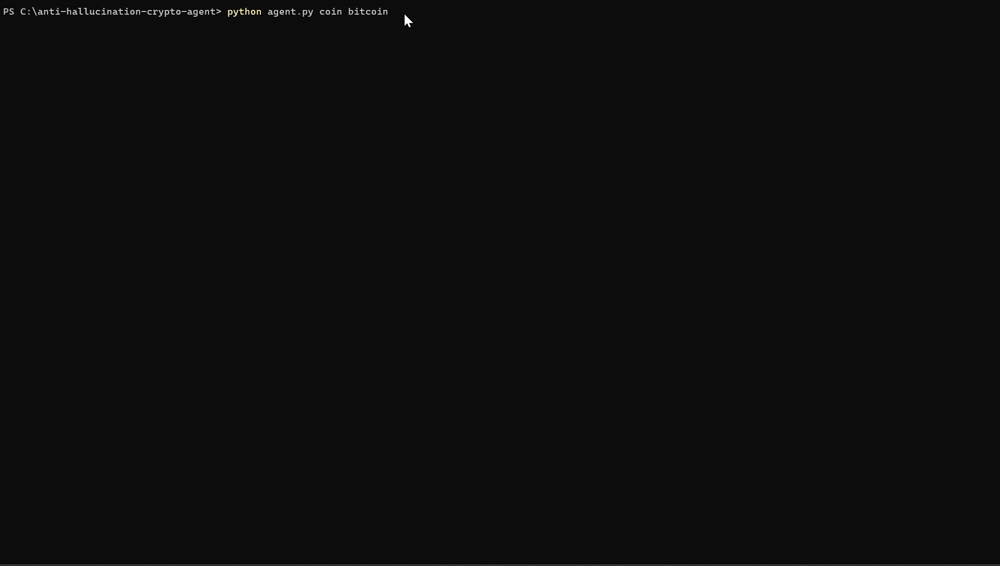

# anti-hallucination-crypto-agent

> A Python agent that analyzes crypto markets using AI — and **proves** it didn't make anything up.




---

## The Problem

Every AI crypto tool sounds confident. None of them can prove they didn't invent the data.

Ask an LLM to analyze Bitcoin and it will tell you the volume is "moderate", the movement is "significant", and the lower Bollinger Band is holding as support — even when the math says the price is sitting at dead center with a Z-Score of -0.6. That's not analysis. That's pattern-matching from training data dressed up as financial insight.

In traditional software, a wrong answer is a bug you can catch. In AI, a confident wrong answer looks **identical** to a confident right one. That's not a UX problem — it's a capital risk.

We built a different architecture. Before any insight reaches you, a deterministic Python math engine runs four sequential filters over the LLM's output, strips every claim that contradicts the actual numbers, and emits a **cryptographic receipt** proving exactly what was corrected.

---

## How It Works

```
┌─────────────────────────────────────────────────────────────┐
│  RADAR 4-LAYER ANTI-HALLUCINATION PIPELINE                  │
│                                                             │
│  LAYER 1 — Math Engine                                      │
│  Python calculates Z-Score, Bollinger Bands, regime         │
│  BEFORE the LLM sees any data                               │
│                           ↓                                 │
│  LAYER 2 — Prompt Injection (10 Laws)                       │
│  Math values injected as NON-NEGOTIABLE constraints         │
│  into the LLM prompt. Laws 0-9 restrict what AI can claim   │
│                           ↓                                 │
│  LAYER 3 — Numeric Override                                 │
│  After the LLM responds, Python overwrites 9+ fields        │
│  The AI never has the last word on the numbers              │
│                           ↓                                 │
│  LAYER 4 — Lexical Filters (4 deterministic filters)        │
│  Strips sentences containing: inflated volume claims,       │
│  magnitude inflation, certainty markers, band-position      │
│  contradictions — ~300 lexical pattern combinations         │
│                           ↓                                 │
│  ✅ SHA-256 AUDIT TRAIL EMITTED                             │
│  protocol_hash certifies exactly which corrections ran      │
└─────────────────────────────────────────────────────────────┘
```

The LLM generates the language. The math engine generates the truth.

---

## Quick Start

```bash
# 1. Clone
git clone https://github.com/Jegoba90/anti-hallucination-crypto-agent.git
cd anti-hallucination-crypto-agent

# 2. Install dependencies
pip install -r requirements.txt

# 3. Get your free API key (14-day trial, no credit card)
#    https://cryptocapi.com → Sign up → Activate trial

# 4. Configure
cp .env.example .env
# Edit .env and set: CRYPTOCAPI_API_KEY=sk_live_...

# 5. Run
python agent.py coin bitcoin
```

That's it. You'll see the analysis **and** the audit trail proving it was verified.

---

## Output

```
───────────────────────────────────────────────────────
  CRYPTOCAPI RADAR — Bitcoin (BTC)
  2026-06-19 14:32:07 UTC
───────────────────────────────────────────────────────

  ↔️  MARKET REGIME:   RANGING_CHOP
  ➡️  SENTIMENT:       neutral
  🎯 CONFIDENCE:      MEDIUM (0.64)
  🔺 Z-SCORE:         -0.637 (no anomaly)

  ANALYSIS:
   El activo opera en zona de equilibrio técnico sin
   catalizador fundamental relevante en las últimas 24h.

───────────────────────────────────────────────────────
  🛡️  ANTI-HALLUCINATION AUDIT TRAIL
───────────────────────────────────────────────────────

  Pipeline:  Radar 4-Layer Anti-Hallucination Pipeline
  Version:   v2.1.0-radar
  Seal type: process_seal
             Certifies the 4-layer pipeline ran with these
             exact corrections. Text is not reproducible
             (LLM is non-deterministic by design).

  Filters fired (2):
    ✂️  [LEY 7 volume]          — Removed qualitative volume
                                  claim (no actual volume data)
    ✂️  [band position          — Removed lower-band claim
        CENTRO_BANDAS]            (price was at center, not
                                  near any band)

  Fields overridden by Python (4):
    🔒  analysis.confidence
    🔒  analysis.sentiment_score
    🔒  confidence
    🔒  sentiment

  ⚠  Sentiment was overridden by Z-Score rule

  Protocol hash (SHA-256):
    0x8ac8aee2cc176fcfaefb6890b4c3e6af4dc642bc52e05d1ca235901929f31554

───────────────────────────────────────────────────────
  ✅ Math Override Certified (CTC-2026)
───────────────────────────────────────────────────────
```

---

## Commands

```bash
# Analyze a single coin
python agent.py coin bitcoin
python agent.py coin ethereum
python agent.py coin solana

# Watch mode — refresh every 30 minutes, flag sentiment changes
python agent.py coin bitcoin --watch
python agent.py coin bitcoin --watch --interval 15

# Market scan — rank all tracked assets by signal strength
python agent.py scan
python agent.py scan --strategy aggressive --limit 5
python agent.py scan --strategy conservative

# Batch — analyze multiple coins in one request
python agent.py batch bitcoin ethereum solana
```

---

## Verify the Hash Yourself

The `protocol_hash` in every Radar response is a SHA-256 digest of the audit inputs. You can verify it independently with 5 lines of Python — no dependencies, no CryptoCapi account needed.

```python
import hashlib, json

# Copy these values directly from the API response audit_trail
payload = {
    "algorithm_id": "Radar 4-Layer Anti-Hallucination Pipeline",
    "engine_version": "v2.1.0-radar",
    "fields_overridden": ["analysis.confidence", "analysis.sentiment_score", "confidence", "sentiment"],
    "filters_applied": ["LEY 7 volume", "band position CENTRO_BANDAS"],
    "market_regime": "RANGING_CHOP",
    "sentiment": "neutral",
    "sentiment_override": True,
    "z_score": -0.6367
}

serialized = json.dumps(payload, sort_keys=True, separators=(",", ":"))
digest = "0x" + hashlib.sha256(serialized.encode()).hexdigest()

print(digest)
# → 0x8ac8aee2cc176fcfaefb6890b4c3e6af4dc642bc52e05d1ca235901929f31554
# This matches the protocol_hash in the API response exactly.
```

If the hash matches → the pipeline ran with those exact corrections and nothing was tampered with.

---

## Use It in Your Own Code

The `cryptocapi/` package is designed to be copied directly into your project:

```python
import asyncio
from cryptocapi import CryptoCapiClient, parse_audit_trail

async def main():
    client = CryptoCapiClient(api_key="sk_live_...")
    data = await client.get_insight("bitcoin")

    # Use the insight
    print(data["sentiment"])        # neutral
    print(data["market_regime"])    # RANGING_CHOP

    # Inspect the audit trail
    math = data.get("math_diagnostics", {})
    audit = parse_audit_trail(math.get("audit_trail"))

    if audit.is_pro:
        print(f"Filters fired: {[f[0] for f in audit.filters]}")
        print(f"Fields Python overrode: {audit.fields_overridden}")
        print(f"Hash: {audit.protocol_hash}")

asyncio.run(main())
```

---

## Project Structure

```
├── agent.py               # CLI entry point (Typer)
├── cryptocapi/
│   ├── client.py          # Async HTTP client — copy this into your project
│   ├── models.py          # TypedDicts for full API response
│   └── audit.py           # Audit trail parser + filter explanations
├── display/
│   ├── terminal.py        # Rich terminal renderer
│   └── themes.py          # Color scheme
├── examples/
│   ├── basic_analysis.py  # Minimal: analyze BTC in 20 lines
│   ├── watch_mode.py      # Poll + detect sentiment changes
│   ├── market_scanner.py  # Screener using market-scan endpoint
│   └── batch_compare.py   # BTC vs ETH vs SOL side by side
└── tests/
    ├── test_audit_parser.py      # 17 tests, zero external dependencies
    └── fixtures/sample_response.json
```

---

## Run the Tests

```bash
pip install pytest
pytest tests/ -v
```

17 tests, no network calls required — all run against a local fixture.

---

## Powered by CryptoCapi

This agent is built on [CryptoCapi](https://cryptocapi.com) — a crypto intelligence API designed specifically for machine consumption.

Unlike general-purpose LLM wrappers, CryptoCapi's Radar engine runs a deterministic Python math pipeline between the AI and every API response. Every numeric field is computed by Python, not the LLM. Every qualitative claim is cross-validated against the math. And every response ships with a SHA-256 audit trail you can verify independently.

**Get your free 14-day trial** (no credit card required): [cryptocapi.com](https://cryptocapi.com)

---

## ⚠️ Disclaimer

This tool is for educational and informational purposes only. It does not constitute financial advice. Never make investment decisions based solely on automated analysis tools. Crypto markets are highly volatile and past performance does not indicate future results.

---

## License

MIT — use it, fork it, copy the `cryptocapi/` package into your own project.
